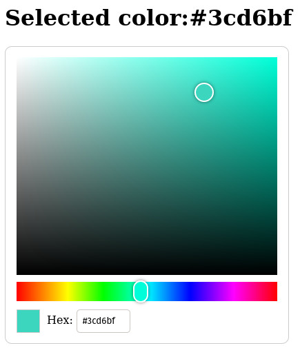

# react-color-picker

A React color picker component



## Install

### NPM:
```
npm install @super-effective/react-color-picker
```

### Yarn:
```
yarn add @super-effective/react-color-picker
```

## Usage
Import the component:
```js
import ReactColorPicker from '@super-effective/react-color-picker';
```

Render the component in your code:
```js
<ReactColorPicker color={color} onChange={onColorChange} /
```

### Props
|Prop  |Type|Details|
|------|---|-------|
|`className`|`string`|The class name to put on the container div|
|`color`|`string`|The initial/current selected color (hex value, e.g. #ff00ff)|
|`showSwatch`|`bool`|Whether the selected color swatch should be displayed below the picker|
|`showHex`|`bool`|Whether the hex value input should be displayed below the picker|
|`onChange`|`func`|The callback function to be called when the color value changes|
|`onInteractionStart`|`func`|The callback function to be called when interaction starts with one of the value selectors|
|`onInteractionEnd`|`func`|The callback function to be called when interaction ends with one of the value selectors|

### Example
See the [included example](example/) for reference
```js
import React, { useState } from 'react';
import ReactColorPicker from '@super-effective/react-color-picker';

import styles from './App.module.scss';

const App = () => {
  const [color, setColor] = useState('#3cd6bf');
  const [isInteracting, setIsInteracting] = useState(false);

  const onColorChange = (updatedColor) => {
    setColor(updatedColor);
  };

  const onInteractionStart = () => {
    setIsInteracting(true);
  };

  const onInteractionEnd = () => {
    setIsInteracting(false);
  };

  return (
    <div className={styles.app}>
      <h1>
        Selected color:
        {color}
      </h1>
      <p>
        Is interacting?
        &nbsp;
        {isInteracting ? 'Yes' : 'No'}
      </p>
      <div className={styles.color_picker}>
        <ReactColorPicker
          color={color}
          onChange={onColorChange}
          onInteractionStart={onInteractionStart}
          onInteractionEnd={onInteractionEnd}
        />
      </div>
    </div>
  );
};

export default App;
```